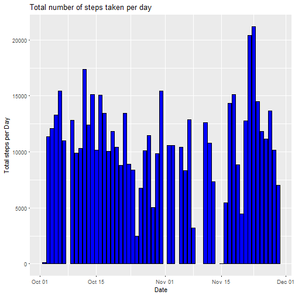
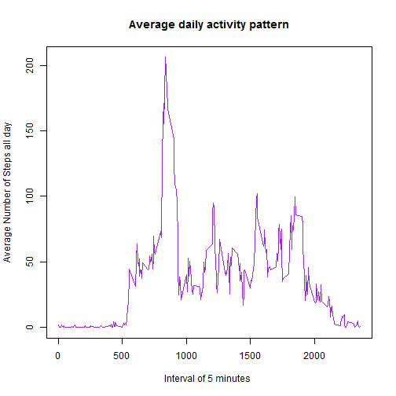
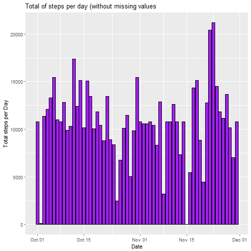

Reproducible Reseach class: Course_Project1
===========================================

## 0. Loading and preprocessing the data
  Uploading library, the data and formating the date variable

```r
library(knitr)
library(markdown)
library(ggplot2)
library(lattice)

data <- read.csv("activity.csv", header=TRUE)
data$date <- as.Date(data$date, "%Y-%m-%d")
summary(data)
```

```
##      steps             date               interval     
##  Min.   :  0.00   Min.   :2012-10-01   Min.   :   0.0  
##  1st Qu.:  0.00   1st Qu.:2012-10-16   1st Qu.: 588.8  
##  Median :  0.00   Median :2012-10-31   Median :1177.5  
##  Mean   : 37.38   Mean   :2012-10-31   Mean   :1177.5  
##  3rd Qu.: 12.00   3rd Qu.:2012-11-15   3rd Qu.:1766.2  
##  Max.   :806.00   Max.   :2012-11-30   Max.   :2355.0  
##  NA's   :2304
```

## 1. What is mean total number of steps taken per day?
For this part of the assignment, you can ignore the missing values in the dataset.

```r
data_without_NA <- subset(data, is.na(data$steps) == FALSE)
```

- 1.1. Calculate the total number of steps taken per day

```r
tot_steps_day <- aggregate(steps ~ date,  data=data_without_NA, sum)
head(tot_steps_day)
```

```
##         date steps
## 1 2012-10-02   126
## 2 2012-10-03 11352
## 3 2012-10-04 12116
## 4 2012-10-05 13294
## 5 2012-10-06 15420
## 6 2012-10-07 11015
```

- 1.2. If you do not understand the difference between a histogram and a barplot, research the difference between them. Make a histogram of the total number of steps taken each day

```r
ggplot(tot_steps_day, aes(x=date, y=steps)) +
    geom_bar(fill="blue", color="black", stat="identity") +
    labs(x="Date", y="Total steps per Day", title="Total number of steps taken per day")
```



- 1.3. Calculate and report the mean and median of the total number of steps taken per day

```r
mean_1_3 <- mean(tot_steps_day$steps)
median_1_3 <- median(tot_steps_day$steps)
```
The mean is 10766.19 and the median is 10765


## 2. What is the average daily activity pattern?
- 2.1. Make a time series plot (i.e. type = "l") of the 5-minute interval (x-axis) and the average number of steps taken, averaged across all days (y-axis).

```r
mean_steps_interval <- aggregate(steps ~ interval,  data=data, mean)
#mean_steps_interval <- tapply(data$steps, data$interval, mean, na.rm = TRUE)
plot(mean_steps_interval$interval, mean_steps_interval$steps, 
     xlab="Interval of 5 minutes ", ylab="Average Number of Steps all day", 
     main="Average daily activity pattern", type="l", col="purple")
```



- 2.2. Which 5-minute interval, on average across all the days in the dataset, contains the maximum number of steps?

```r
answer2_2 <- mean_steps_interval[which.max(mean_steps_interval$steps),1]
```
The maximum number of steps is the interval 835


## 3. Imputing missing values
Note that there are a number of days/intervals where there are missing values (coded as NA). The presence of missing days may introduce bias into some calculations or summaries of the data.

- 3.1. Calculate and report the total number of missing values in the dataset (i.e. the total number of rows with NAs)

```r
na_3_1 <- sum(is.na(data))
```
The total number of missing days/intervals is 2304


- 3.2. Devise a strategy for filling in all of the missing values in the dataset. The strategy does not need to be sophisticated. For example, you could use the mean/median for that day, or the mean for that 5-minute interval, etc.

-- The strategy is to use the mean steps per 5-minute intervals to replace the missing values.
  
  
- 3.3. Create a new dataset that is equal to the original dataset but with the missing data filled in.

```r
mean_steps <- tapply(data$steps, data$interval, mean, na.rm = TRUE)
is_na <- which(is.na(data))
imputing <- mean_steps[as.character(data[is_na, 3])]
names(imputing) <- is_na
for (i in is_na) {
    data$steps[i] = imputing[as.character(i)]
}
sum(is.na(data))
```

```
## [1] 0
```

- 3.4. Make a histogram of the total number of steps taken each day and Calculate and report the mean and median total number of steps taken per day. Do these values differ from the estimates from the first part of the assignment? What is the impact of imputing missing data on the estimates of the total daily number of steps?

```r
tot_steps_day_no_na <- aggregate(steps ~ date,  data=data, sum)
ggplot(tot_steps_day_no_na, aes(x=date, y=steps)) +
    geom_bar(fill="purple", color="black", stat="identity") +
    labs(x="Date", y="Total steps per Day", title="Total of steps per day (without missing values")
```



```r
mean_3_4 <- mean(tot_steps_day_no_na$steps)
median_3_4 <- median(tot_steps_day_no_na$steps)
diff_mean <- abs(mean_3_4 - mean_1_3)
diff_median <- abs(median_3_4 - median_1_3)
pct_mean <- abs(mean_3_4 - mean_1_3)/mean_1_3
pct_median <- abs(median_3_4 - median_1_3)/median_1_3
```
- Without missing values, the steps mean is 10766.19 and the steps median is 10766.19;
- The difference between the two means is 0 and the impact is 0;
- The difference between the two medians is 1.188679 and the impact is 0.0001104207;


## 4. Are there differences in activity patterns between weekdays and weekends?
For this part the weekdays() function may be of some help here. Use the dataset with the filled-in missing values for this part.

- 4.1. Create a new factor variable in the dataset with two levels - "weekday" and "weekend" indicating whether a given date is a weekday or weekend day.

```r
data$weekdays <- weekdays(as.Date(data$date))
data$weekdays <- ifelse(data$weekdays %in% c("Saturday", "Sunday"), "weekend", "weekday")
```

- 4.2. Make a panel plot containing a time series plot (i.e. type = "l") of the 5-minute interval (x-axis) and the average number of steps taken, averaged across all weekday days or weekend days (y-axis). See the README file in the GitHub repository to see an example of what this plot should look like using simulated data.

```r
mean_steps <- aggregate(data$steps, by = list(data$interval, data$weekdays), mean)
names(mean_steps) <- c("interval", "weekdays", "steps")
xyplot(steps ~ interval | weekdays, mean_steps, type = "l", layout = c(1, 2), 
       xlab = "Interval", ylab = "Number of steps")
```


